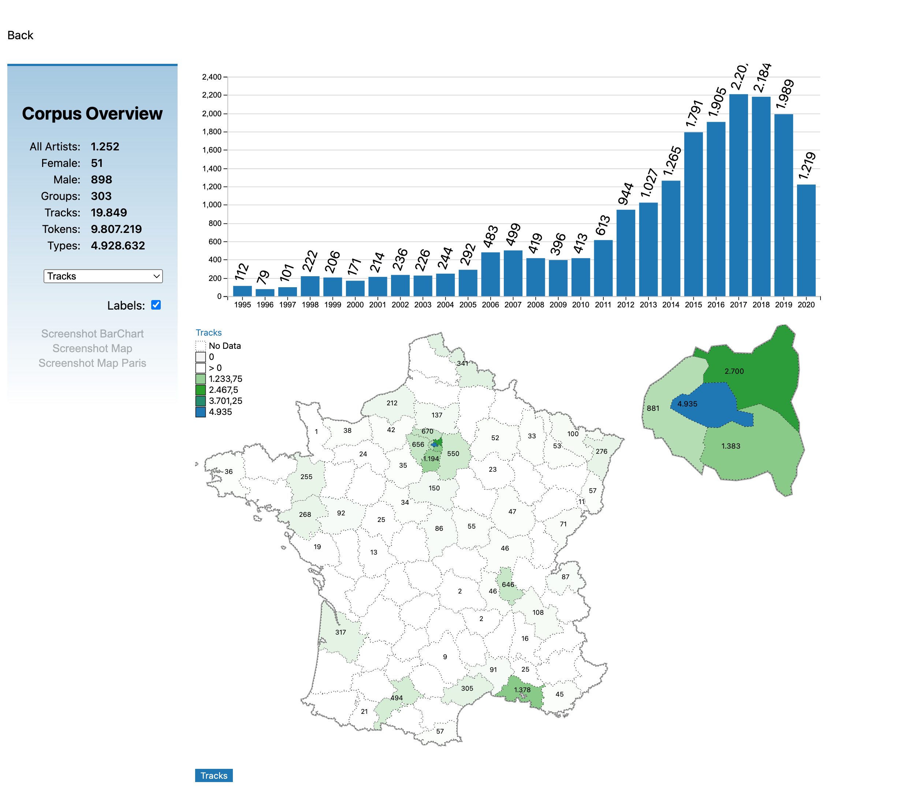

# FRC-Visualization

French rap corpus visualization using [lotivis.js](https://github.com/lotivis/lotivis).



## Contents

- [Getting started](#getting-started)
- [Assets creation](#assets-creation)
- [Development](#development)
- [CI / Docker](#ci--docker)

## Getting started

1) Clone project locally.

```bash
git clone https://github.com/lukasdanckwerth/frc-visualization.git
```

2) Build `frc.js` library.

```bash
yarn install && yarn run build
```

3) Start `http-server`.

```bash
yarn run serve
```

## Assets creation

Creating all assets creation sub commands can be run by:

```bash
yarn run assets
```

| Command | Description |
| - | - |
| `yarn run assets:about`{:.bash} | Creates the [`about.json`](./data/about.json). |
| `yarn run assets:datasets:overview`{:.bash} | Creates the corpus overview data. |

## Development

```sh
# ... or build with watching files for development
yarn build:watch

yarn build:watch:serve
```

## CI / Docker

| Environment | Branch | URL | Docker |
| - | - | - | - |
| Development | [`dev`](https://github.com/lukasdanckwerth/frc-visualization/tree/dev)  | https://frc-visualization-dev.onrender.com | [](https://github.com/lukasdanckwerth/frc-visualization/actions/workflows/test-docker.yml) |
| Stage | [`stage`](https://github.com/lukasdanckwerth/frc-visualization/tree/stage) | https://frc-visualization-stage.onrender.com | [](https://github.com/lukasdanckwerth/frc-visualization/actions/workflows/test-docker.yml) |
| Production | [`main`](https://github.com/lukasdanckwerth/frc-visualization/tree/main) | https://frc-visualization.onrender.com | [](https://github.com/lukasdanckwerth/frc-visualization/actions/workflows/test-docker.yml) |
